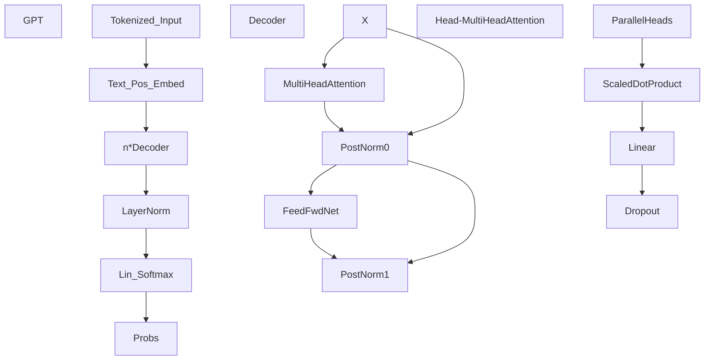

# PyTorch GPT LLM

This project implements a Generative Pre-trained Transformer for Large Language Models (GPT-LLM) using PyTorch. GPT-LLM is a variant of the transformer architecture introduced by google which focuses on textual data . It differs from the general transformers as it has only 1  add and norm blocks which is masked with a lower triangular matrix.

## Table of Contents
- Introduction
- Setup
- Shapes-Breakdown
- Results

## Introduction
The GPT-LLM model is trained to predict the next token in a sequence of text given the previous tokens. It utilizes multi-head self-attention mechanisms and positional embeddings to capture dependencies between tokens and generate coherent sequences of text. It works on the bi-gram text data model (next word dependent on the previous word).
Model architecture:


## Setup
1. Install Python Dependencies: `pip install torch`
2. Clone the repository: `git clone https://github.com/eshan1347/GPT && cd GPT`
3. Train the model: `python gptTrain.py -bs batch_size -lr learning_rate -e epochs -ev evaluation_epochs -blk block_size`
4. Run the model: `python app.py`
5. Enter the prompts

## Shapes- Breakdown :
This is simple breakdown of the tensor shapes transformation to keep track of the appropriate shapes and understand the computations taking place:
```
#Tensor Shapes breakdown : model.forward() | B: Batch Size  T: TimeStamp / Block_Size  C: Char Embedding
#Input: [B,T] --(text embed)--> [B,T,C] + [T] --(pos embed)--> [T,C] --> [B,T,C]
#  Decoder Block : (
#    MultiHeadAttention : (
#      concatenate n_heads at last dim (
#        Head : 4 k,q,v - {ip[B,T,C] -> [B,T,headSize]}
#         : wei : q[B,T,headSize] @ k.T[B,headSize,T] --> [B,T,T] --masked fill(0=>-inf) / softmax /dropout--> [B,T,T]
#         : op : wei[B,T,T] @ v[B,T,headsize] => [B,T,headSize]
#       ) - [B,T,headSize]*n --> [B,T,headSize*n=C] --Linear / dropout--> [B,T,C]
#    ) - mulAtt[B,T,C] + x[B,T,C] --NormLayer--> [B,T,C] + FeedForward[B,T,C] --NormLayer--> [B,T,C]
#  ) - [B,T,C] --NormLayer / Linear--> [B,T,Vocab_size]
# if op is not None : logits[B,T,Vocab_size] --View--> [B*T,Vocab_size] & op[B,T] --> [B*T]
# loss = crossEntropy( logits[B*T,Vocab_size]  and op[B*T])
# return logits[B*T, Vocab_size], loss[1]
```
## Results
This model was trained on a limited amount of data due to computation restrictions , only 20,000 lines of txt: Entire works of Shakespeare of which a huge chunk are stopwords and spaces. But even after these
not so ideal conditions - the model performs really well. I have trained the model for 5000 epochs and it gives fairly good results
Loss:
```
Epochs: 0 | Train Loss : 0.018695490434765816 | Val Loss : 0.01684853434562683
Epochs: 250 | Train Loss : 2.5198676586151123 | Val Loss : 2.4918735027313232
Epochs: 500 | Train Loss : 2.022209405899048 | Val Loss : 1.974984049797058
Epochs: 750 | Train Loss : 1.8320703506469727 | Val Loss : 1.7776026725769043
Epochs: 1000 | Train Loss : 1.7226777076721191 | Val Loss : 1.6637442111968994
Epochs: 1250 | Train Loss : 1.6475147008895874 | Val Loss : 1.5841188430786133
Epochs: 1500 | Train Loss : 1.5925300121307373 | Val Loss : 1.528916358947754
Epochs: 1750 | Train Loss : 1.5550779104232788 | Val Loss : 1.4881770610809326
Epochs: 2000 | Train Loss : 1.5215644836425781 | Val Loss : 1.4590550661087036
Epochs: 2250 | Train Loss : 1.4917501211166382 | Val Loss : 1.4347412586212158
Epochs: 2500 | Train Loss : 1.4724901914596558 | Val Loss : 1.4120631217956543
Epochs: 2750 | Train Loss : 1.4558329582214355 | Val Loss : 1.397450566291809
Epochs: 3000 | Train Loss : 1.4396388530731201 | Val Loss : 1.3817299604415894
Epochs: 3250 | Train Loss : 1.4276973009109497 | Val Loss : 1.3671742677688599
Epochs: 3500 | Train Loss : 1.4123567342758179 | Val Loss : 1.3551188707351685
Epochs: 3750 | Train Loss : 1.4037237167358398 | Val Loss : 1.3477764129638672
Epochs: 4000 | Train Loss : 1.3957078456878662 | Val Loss : 1.3372347354888916
Epochs: 4250 | Train Loss : 1.3839141130447388 | Val Loss : 1.3291704654693604
Epochs: 4500 | Train Loss : 1.3788118362426758 | Val Loss : 1.3235182762145996
Epochs: 4750 | Train Loss : 1.3715656995773315 | Val Loss : 1.3150203227996826
CPU times: user 17min 21s, sys: 1min 11s, total: 18min 33s
Wall time: 18min 40s
```
Output:
```


ACT I

SCENE I. A true in troop.

 Enter Cymbeline, Roderigo.


ACT II

SCENE I. An old Capulet’s papartness.

Enter Kent France and Gloucester.

[_Exit._]


ACT II


SCENE I. The Dowest pardon Benedick.

 ACT II
 Scene I. London. As this trust of Apoly confance
 Scene England and an Edward and all night;
’Tis doubt unto her place.

[_Exeunt Servant._]

SCENE V. Longavill, Somerset in Camps’ Garter’s horse.

 Enter Lancaster.

VERGES..
Your sword are for “hand, no!”

ORLANDO.
My sea a day, in
```
